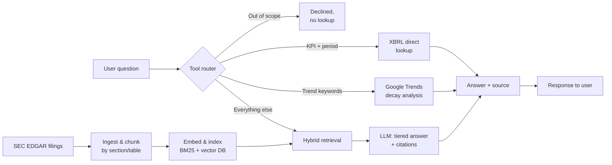
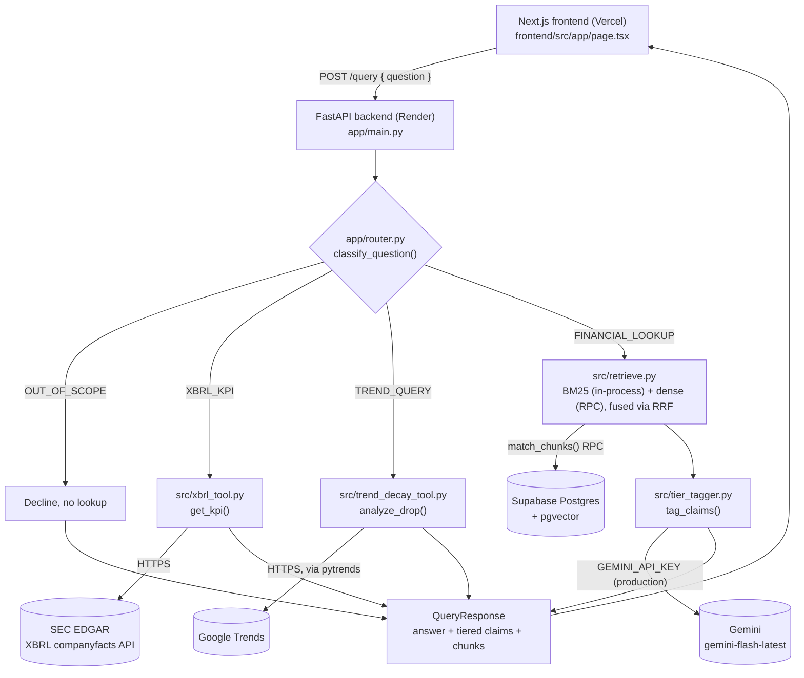
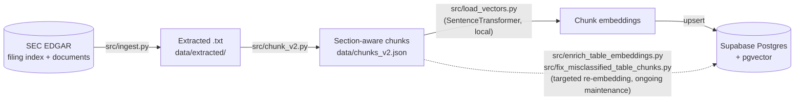

# Levi's RAG — AI Due Diligence Copilot


-blue)


A RAG-powered ("Retrieval-Augmented Generation" — pairing a document search
step with an LLM's answer generation, so answers are grounded in retrieved
evidence rather than invented) tool for evidence-tiered analysis of Levi
Strauss & Co.'s publicly available SEC EDGAR filings and strategic
narrative.

**Live app:** https://levis-rag.vercel.app<br>
**Backend API:** https://levis-rag.onrender.com (`GET /health`, `POST /query`)

---

## Overview

This project answers natural-language financial questions about a single
public company (Levi Strauss & Co., SEC CIK: 0000094845), using only its
official SEC filings (10-K annual reports, 10-Q quarterly reports, 8-K
current reports) as source material.

**The problem it solves:** doing quick, evidence-backed due diligence on a
company usually means manually digging through dozens of dense filings to
find one number, or trusting a generic chatbot's answer with no way to
verify where it came from. This tool sits in between — it answers the
question *and* shows exactly which filing, which section, and which
sentence the answer came from, tagged by how strong that evidence actually
is.

**Who it's for:** an equity research associate or analyst doing single-name
due diligence on Levi Strauss & Co. — someone who needs a fast answer but
still needs to trust and verify it before using it in real work.

**What the user gets:** ask a question like *"What was Levi's FY2025 gross
margin?"* and get back a direct answer, the specific filing chunk it's
grounded in, and an evidentiary tier that says how much weight to put on
it:

- `Verified-from-filing` — stated directly in a filing
- `Management-qualitative-statement` — said by management, not a hard number
- `Third-party-benchmark` — sourced from an external report or vendor claim
- `Model-inference` — the system's own calculation or conclusion

---

## Why I Built This

This project builds on "The Denim Lifestyle Pivot" — a BUAN 6390 Analytics
Practicum equity research report (Group 7, May 2026) that analyzed a $50M
strategic transformation proposal for Levi Strauss & Co., including several
strategic and market-trend claims about the brand.

Reports like that make claims about growth strategy, market position, and
consumer trends that sound plausible but aren't always checked against
the company's own primary evidence. I wanted to test that idea directly: can
those claims be verified, refuted, or shown to be untestable using only
what Levi's has actually filed with the SEC and what's independently
observable, like public search-interest data? Building the tool to answer
that question turned into a full applied AI engineering exercise (hybrid
retrieval, evidence grounding, tool orchestration, evaluation-driven
tuning, and production deployment), documented throughout this README.

---

## What Makes It Different

- **Evidence-tiered answers, not just answers.** Every claim the system
  makes is tagged with where it came from and how reliable that source is,
  instead of returning one undifferentiated block of generated text.
- **Hybrid retrieval.** Combines classic keyword search (BM25) with
  meaning-based semantic search (dense vector embeddings), fused together
  so the system catches both exact-term matches and conceptually similar
  passages that don't share exact wording.
- **Direct XBRL lookups for hard numbers.** For a single clean KPI in a
  single period, the system bypasses text search entirely and pulls the
  figure straight from the SEC's structured, machine-readable financial
  data feed (XBRL) — more reliable than parsing prose for something that's
  already available as clean, tagged data.
- **Trend analysis, not just filings.** A separate tool checks public
  Google Trends search-interest data against a specific strategic claim
  from the source report about how long a marketing "moment" lasts.
- **Out-of-scope handling.** The system is designed to decline questions it
  can't answer from its actual source material (competitor data, stock
  price, earnings-call color) rather than guessing.
- **Evaluation-driven development.** Every retrieval change in this
  project was measured against a 60-question hand-labeled test set and
  only kept if it produced a real, verified improvement — not tuned by
  feel.

---

## Key Features

- Automated ingestion and structure-aware chunking of 41 real SEC filings
- Hybrid BM25 + dense-vector retrieval with fiscal-year and quarter-aware
  filtering, so the system distinguishes "FY2024" from "FY2025" content
  even when the filing text itself never says the year explicitly
- Evidentiary-tier claim tagging via structured LLM output (schema-enforced,
  not just prompted), with a supporting citation on every claim
- A tool router that automatically sends KPI questions to a direct
  financial-data API instead of text search, and trend questions to a
  dedicated statistical analysis tool
- A hand-labeled, 60-question evaluation harness plus a pytest regression
  suite, both run before and after every change
- A deployed, full-stack live demo (Next.js chat UI + FastAPI backend)

---

## How the System Works



1. **Ingestion** — filings are pulled from SEC EDGAR and split into
   section-aware chunks (preserving MD&A, Notes, Risk Factors boundaries),
   with financial tables kept intact rather than split mid-table.
2. **Indexing** — each chunk is embedded into a vector representation and
   stored alongside a keyword (BM25) index, tagged with its fiscal year and
   quarter where known.
3. **Routing** — every incoming question is first classified into one of
   four paths: declined as out-of-scope, sent to the direct KPI lookup
   tool, sent to the trend-analysis tool, or sent to retrieval.
4. **Retrieval** — for the default path, both the keyword and vector search
   run in parallel, filtered to the fiscal period the question actually
   asks about, and their rankings are merged (Reciprocal Rank Fusion, a
   way of combining two ranked lists so a chunk that ranks well in *either*
   method surfaces near the top).
5. **Answer generation and evidence tagging** — the retrieved chunks are
   passed to an LLM, which produces an answer where every individual claim
   is tagged with one of the four evidentiary tiers and a specific
   supporting chunk id.
6. **Citations** — the final response includes the answer, each tagged
   claim, and the underlying chunks (filing, section, fiscal year), so the
   user can trace any statement back to its source.

---

## Architecture

The diagram above is the narrative version. This section is the precise,
current-state one — verified directly against the deployed code (not the
original project scope doc) — split into two layers that run at genuinely
different times.

### Request-time path (what runs on a live `POST /query` call)



- The router (`app/router.py`) is a first-match-wins heuristic, not a
  trained classifier — four dispatch paths, checked in this order:
  `OUT_OF_SCOPE` → `XBRL_KPI` → `TREND_QUERY` → `FINANCIAL_LOOKUP`.
- Each path's external dependency is genuinely different: `XBRL_KPI` calls
  EDGAR's structured XBRL API directly (no LLM, no retrieval); `TREND_QUERY`
  calls Google Trends via `pytrends`; `FINANCIAL_LOOKUP` is the only path
  that touches both Supabase (dense vector search) and Gemini (evidentiary
  claim tagging) — the BM25 leg runs in-process against the FastAPI
  server's own in-memory copy of `data/chunks_v2.json`, loaded once at
  startup, not queried externally.
- `GEMINI_API_KEY` is production's key, exclusively — `app/routers/query.py`
  is the only place it's read. The frontend's own code only ever calls
  `POST /query`; `GET /health` exists as a liveness endpoint (used for
  deploy checks and cold-start monitoring) but isn't called by the chat UI
  itself.

### Offline / enrichment path (runs before deployment, not per request)



- This pipeline produces the two things the request-time path reads:
  `data/chunks_v2.json` (loaded into the FastAPI process at startup, for
  BM25) and the Supabase `chunks` table (queried live, for the dense leg).
  It runs once per ingestion/re-embedding pass, not on any user request.
- Note the deployed API's embedding *runtime* differs from this pipeline's:
  ingestion embeds locally via `sentence-transformers`, but the live
  request path (`src/retrieve.py`) encodes each incoming question through
  an exported ONNX build of the same model instead, to fit the hosting
  tier's memory limit — verified numerically identical (cosine 1.0)
  before switching, so this doesn't affect what gets indexed vs. what gets
  queried.

---

## Results and Evaluation

Retrieval quality is measured against a 60-question hand-labeled evaluation
set (`data/eval_set.json`) covering five question types (numeric lookups,
trend comparisons, qualitative questions, inference questions, and
out-of-scope questions). Scoring: **HIT** = the correct source chunk is in
the top 10 retrieved results; **PARTIAL** = an acceptable-but-not-ideal
chunk is; **MISS** = neither.

| Metric | Score |
|---|---|
| recall@10 (HIT) | **85.0% (51/60)** |
| Partial credit | 8.3% (5/60) |
| Miss | 6.7% (4/60) |

**The system started at a 40.0% recall@10 baseline.** Standard fusion-tuning
(adjusting the ranking-fusion parameters across a 6-configuration grid)
found no improvement beyond noise — the real gap turned out to be
structural, not a tuning problem (see Engineering Highlights below for the
fixes that closed it).

**Important caveat on the remaining 4 misses:** all four are out-of-scope
questions that the system correctly declines to answer, but the automated
scorer has no separate "correctly rejected" verdict, so a correct decline
still counts as a MISS. Once that's accounted for, **real retrieval
misses are effectively 0 out of 60**: everything the system is actually
supposed to retrieve, it retrieves.

---

## Engineering Highlights

The biggest gains came from diagnosing *why* retrieval was failing before
trying to fix it, rather than guessing at parameters. A few of the most
significant problems and fixes:

- **Quarter-aware period filtering (recall@10 40.0% → 58.3%).** Every
  filing repeats near-identical boilerplate language for things like
  disaggregated revenue tables, with dates spelled out ("November 30,
  2025") rather than labeled ("FY2025") — so a filing from the wrong
  period could out-rank the correct one on pure text/keyword similarity.
  The fix extracts the fiscal year *and* quarter directly from the
  question and filters both the keyword and vector search legs to the
  matching period, with explicit handling for two edge cases: Levi's Q4
  has no dedicated quarterly filing (only the annual report), and a
  single-year question can also legitimately match the *following* year's
  filing, since annual reports restate the prior year for comparison.
- **Vector index tuning (IVFFlat `probes` 10 → 30).** The approximate
  vector index was only scanning a small sample of its search space by
  default, occasionally hiding chunks that were otherwise correctly
  matched. Widening that search sample recovered several points of
  recall with no other changes.
- **Targeted embedding enrichment (recall@10 58.3% → 85.0%).** Some correct
  answer chunks were "diluted" (a real answer buried inside a long,
  mixed-topic financial table), so they scored poorly on semantic
  similarity even though the right text was present. The fix was a
  repeatable playbook: identify the diluted chunk, test a content-specific
  rewording against the target question *and* every other question that
  shares similar vocabulary (to catch cases where fixing one answer could
  accidentally out-rank a different, unrelated one, which happened at
  least once and was caught before shipping), then verify with a full
  60-question regression before keeping the change.
- **Tool router correction.** The router originally sent any question
  containing both a financial metric name and a time period straight to
  the direct KPI lookup tool — even when the question needed more nuance
  than that tool provides. For example, *"What was Levi's DTC revenue as a
  percentage of total revenue in FY2025?"* was being answered with total
  revenue instead of the percentage, even though the retrieval-based path
  already had the right answer. Fixed by adding explicit exclusions for
  segment/percentage/multi-period questions, verified against the full
  affected question set.
- **Production startup fix (Render deployment).** The backend was building
  its retrieval index and AI client at process-startup time, before the
  web server had a chance to open its network port — on a constrained free
  hosting tier, this made the port-availability check time out before the
  app was ever considered "up." Fixed by deferring that setup to run
  immediately after the port opens rather than before.
- **Memory-footprint fix (ONNX runtime).** Even after the startup fix, the
  full embedding-model library (with its GPU-oriented dependencies) didn't
  fit in the free tier's memory limit. The fix was to export the same
  embedding model to a lighter, portable runtime format (ONNX) and run
  inference through that instead — verified numerically identical
  (cosine similarity 1.0) to the original before switching, so retrieval
  quality was unaffected.

---

## Demo

The fastest way to see the system working is the live app itself:

- **Frontend (chat UI):** https://levis-rag.vercel.app
- **Backend API:** https://levis-rag.onrender.com (`GET /health`, `POST /query`)

---

## Tech Stack

| Layer | Tool |
|---|---|
| Embeddings | sentence-transformers/all-MiniLM-L6-v2 — used locally for data ingestion; the deployed API runs the same model's exported ONNX weights instead, to fit within the hosting tier's memory limit (verified numerically equivalent before switching) |
| Generation | Google Gemini Flash (`gemini-flash-latest`, via `google-genai`) |
| Vector store | Supabase Postgres + pgvector |
| Retrieval | BM25 (keyword ranking) + pgvector (dense vector search), fused via Reciprocal Rank Fusion |
| Backend | FastAPI (`app/`) |
| Trend analysis | pytrends (Google Trends) + scipy (curve fitting) |
| Frontend | Next.js + Tailwind, deployed on Vercel |
| Data sources | SEC EDGAR full-text filings + EDGAR XBRL `companyfacts` API (both public, no API key required) |

---

## Data Sources and Scope

All data is sourced from **SEC EDGAR public filings** — no proprietary or
non-public data is used anywhere in this project. The scope is
deliberately narrow: **a single company**, Levi Strauss & Co., across 41
filings (3 annual 10-Ks, 7 quarterly 10-Qs, 31 current 8-Ks) from
2024-01-01 onward. Two independent EDGAR data sources are used: the
plain-text filings themselves (for retrieval) and the XBRL `companyfacts`
API (for direct KPI lookups).

---

## Setup and Running Locally

```bash
git clone https://github.com/sanjay-dilip/levis-rag.git
cd levis-rag
python -m venv venv
venv\Scripts\activate        # Windows
pip install -r requirements.txt
cp .env.example .env         # Add GEMINI_API_KEY, SUPABASE_URL, SUPABASE_SERVICE_KEY
```

`GROQ_API_KEY` and `GEMINI_API_KEY_II` in `.env.example` are optional —
they're only used by a standalone research script comparing two different
LLM providers' tier-tagging quality (`src/tier_comparison_runner.py`), not
by core setup, the pipeline, or the live `/query` path.

**Run the ingestion pipeline** (reproduces the data artifacts from scratch):

```bash
python src/ingest.py                   # Fetch 41 filings from EDGAR → data/extracted/
python src/chunk_v2.py                 # Section-aware chunking → data/chunks_v2.json
python src/load_vectors.py             # Embed + upsert all chunks into Supabase
python src/enrich_table_embeddings.py  # Re-embed table chunks with metadata prefix
python src/fix_fiscal_year_metadata.py # Backfill fiscal_year + period_of_report in Supabase
```

`load_vectors.py` downloads ~80 MB on first run (the embedding model's
weights).

**Run a query from the CLI:**

```bash
python src/query.py "What was Levi's FY2025 gross margin?"
```

**Run the API locally:**

```bash
uvicorn app.main:app --reload
```

```bash
curl http://localhost:8000/health

curl -X POST http://localhost:8000/query \
  -H "Content-Type: application/json" \
  -d '{"question": "What was Levi'\''s FY2025 gross margin?"}'
```

Every response is shaped as:

```json
{
  "question": "...",
  "answer": "...",
  "claims": [{"claim_text": "...", "tier": "...", "supporting_chunk_id": -1, "fiscal_year": null}],
  "chunks": [{"id": 604, "source": "...", "filing_type": "10-K", "section": "...", "fiscal_year": "FY2025", "rrf_score": 0.024, "similarity": 0.544}],
  "out_of_scope": false
}
```

**Try the same request against the live deployment:**

```bash
curl https://levis-rag.onrender.com/health

curl -X POST https://levis-rag.onrender.com/query \
  -H "Content-Type: application/json" \
  -d '{"question": "What was Levi'\''s FY2025 gross margin?"}'
```

**Note on Gemini's free-tier daily quota:** the live `FINANCIAL_LOOKUP` path
can occasionally return an error or take 60-130+ seconds once the day's
Gemini quota (20 requests/day) is exhausted, since the client retries
before giving up. The other three question paths (direct KPI lookup, trend
analysis, out-of-scope decline) don't call Gemini and aren't affected.

---

## Running Tests and Evaluation

```bash
python -m pytest -v
```

```bash
python src/eval_runner.py                          # Default config (k=60, candidates=100)
python src/eval_runner.py --k 30 --candidates 150  # Custom fusion config
python src/eval_runner.py --fy-filter              # Fiscal-year-filtered dense leg
```

---

## Repository / Pipeline Structure

```
levis-rag/
├── app/                    # FastAPI backend
│   ├── main.py             # App factory, CORS, startup lifecycle
│   ├── router.py           # Heuristic question-type dispatch
│   ├── models/             # Request/response schemas
│   └── routers/            # /query and /health route handlers
├── src/                     # Core pipeline: ingestion, retrieval, tools
│   ├── ingest.py, chunk_v2.py, load_vectors.py, ...   # Data pipeline
│   ├── retrieve.py         # Hybrid BM25 + dense retrieval, fusion
│   ├── tier_tagger.py      # Evidentiary-tier claim tagging (Gemini)
│   ├── xbrl_tool.py        # Direct EDGAR XBRL KPI lookups
│   ├── trend_decay_tool.py # Google Trends decay-curve analysis
│   └── eval_runner.py      # Retrieval evaluation harness
├── frontend/                # Next.js chat UI, deployed on Vercel
│   └── src/
│       ├── app/page.tsx    # Chat interface
│       ├── components/     # Tier badges, KPI/trend result cards
│       └── lib/api.ts      # Typed API client
├── data/                    # Eval set, findings docs, cached artifacts
├── tests/                   # pytest suite (router, endpoints, eval smoke)
├── schema.sql               # Supabase database schema
├── render.yaml              # Render deployment config
└── requirements.txt
```

---

## Known Limitations

**Open:**

- **Out-of-scope detection is threshold-tuned, not a trained classifier.**
  A similarity cutoff catches genuinely empty retrievals, but in-scope
  qualitative questions and out-of-scope questions overlap in a middle
  similarity range — one out-of-scope eval question (asking about market
  share) still scores as a partial match rather than a clean decline. The
  keyword-based decline list covers known out-of-corpus topics but isn't
  exhaustive.
- **The evaluation scorer has no "correctly declined" verdict.** Every
  out-of-scope question is scored as a MISS even when the system correctly
  declines to answer it — this inflates the headline miss count (all 4
  current misses are correct declines, not retrieval failures).
- **The tool router is rule-based, not a trained classifier.** A specific
  over-matching bug (KPI questions swallowing questions that needed more
  nuance — see Engineering Highlights) was found and fixed, but the
  rule-based approach remains a known limitation for phrasings not yet
  seen.
- **A merge to `master` is not the same claim as "live in production."**
  Render's auto-deploy has silently failed to fire at least once in this
  project's history — a merged router fix sat stale in production through
  several further merges until a manual redeploy was triggered via the
  Render dashboard. Code changes (as opposed to Supabase-only data fixes,
  which take effect immediately since the backend queries Supabase live)
  now get an explicit "confirmed live in production," not just "merged,"
  before being considered done.

**By design (investigated, resolved, not open bugs):**

- **8-K exhibit gap.** Earnings-release financial tables live in an exhibit
  that isn't ingested; the same audited figures are already present in the
  10-K/10-Q filings that are ingested.
- **Trend-decay estimates are low-confidence and vary between repeated
  pulls, by design.** The underlying Google Trends signal for the
  strategic claim being tested is sparse enough that this is a property of
  the data, not a bug in the analysis (full findings in
  [`data/trend_decay_findings.md`](data/trend_decay_findings.md)).
- **The same figure can have more than one correct value.** Levi's
  divested a brand (Dockers) mid-period, so a figure like "FY2024 total
  revenue" has two legitimate values depending on whether Dockers is
  included or excluded — both are correct, depending on which version of
  the filing data is being cited (full detail in
  [`data/dtc_conflict_finding.md`](data/dtc_conflict_finding.md)).
- **A small, understood class of retrieval near-misses.** A handful of
  questions have their correct answer chunk already ranking as well as
  possible on semantic similarity, but ranking poorly on keyword overlap —
  a combination that the embedding-enrichment technique can't fully close
  without a larger, higher-risk rewrite of how the source text is split
  into chunks. These score as partial matches by design, not as
  unaddressed bugs.
- **Groq/Llama 3.3 70B was benchmarked against Gemini for evidentiary-tier
  tagging quality**, holding retrieval constant across the full
  60-question eval set. Overall accuracy was close (Gemini 75.0% vs. Groq
  71.7%), but Groq never once assigned the
  `Management-qualitative-statement` tier across any of the 9 questions
  expecting it, a direct consequence of Groq offering no schema-enforced
  structured output for this model (only best-effort JSON, with the
  schema described in the prompt rather than mechanically enforced)
  rather than a language-quality gap. Has no effect on the live app: the
  deployed `/query` endpoint remains Gemini-only. Full results:
  [`data/tier_comparison_report.md`](data/tier_comparison_report.md).

---

## Future Improvements

- **Earnings call transcripts** were considered as a data source (some
  claims, like forward-looking revenue guidance, are only ever discussed
  on earnings calls, not filed with the SEC) but deliberately left out —
  transcripts aren't filed or furnished with the SEC, which would expand
  this project's scope beyond its current public-EDGAR-only boundary.
  Adding them later would also require extending the evidentiary-tier
  system to mark forward-looking, unaudited guidance distinctly from
  filed figures.
- **A trained out-of-scope classifier**, to replace the current
  similarity-threshold-plus-keyword-list approach and close the small gap
  documented above.
- **A trained tool router**, to replace the current rule-based dispatch
  logic and generalize better to phrasings not yet seen in testing.

---

## What This Project Demonstrates

- Hybrid retrieval system design — keyword and semantic search fused
  together, with fiscal-period-aware filtering on both
- Retrieval quality diagnosis and iterative tuning against a hand-labeled
  evaluation set, with every change verified by a full regression run
- Evidence-grounded answer generation, keeping every claim traceable to a
  specific filing, external source, or the model's own inference
- Multi-tool orchestration — automatic routing across retrieval-based
  Q&A, a structured financial-data API lookup, and a statistical
  trend-decay analysis
- Production deployment troubleshooting under real resource constraints,
  resolved through a startup-sequencing fix and a lighter model runtime
- Full-stack delivery — a FastAPI backend and Next.js frontend, both
  deployed and tested live, not just locally
- A regression-tested engineering workflow — an automated test suite and a
  retrieval evaluation harness run against every change
- Cross-provider LLM evaluation — comparing schema-enforced structured
  output against a best-effort JSON alternative
